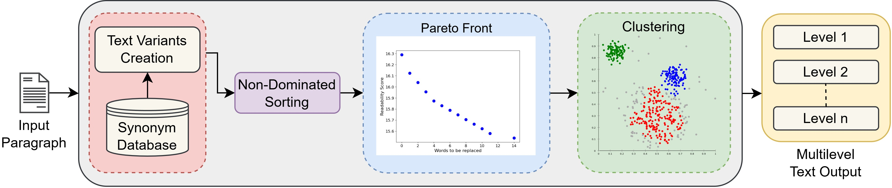

# Progressive Vocabulary Learning via Pareto-Optimal Clustering

This repository contains the official implementation of the paper:

**Deepika Verma, Daison Darlan, Rammohan Mallipeddi**  
*Progressive Vocabulary Learning via Pareto-Optimal Clustering*  
International Conference on ICT Convergence (ICTC), 2025.

## ⚙️ Tech Stack


---

## Overview

Vocabulary acquisition is most effective when learners engage with texts that **gradually increase in lexical complexity**. However, most existing text simplification systems generate **only a single simplified version**, making it difficult to support progressive learning.

This project introduces a framework that generates **multiple semantically consistent variants of a paragraph** and organizes them into **progressive vocabulary levels**.

The system:

1. Generates multiple text variants using **controlled synonym replacement**.
2. Uses **multi-objective optimization (NSGA-II)** to balance:
   - Readability improvement
   - Semantic preservation
3. Extracts **Pareto-optimal text variants** representing the best trade-offs.
4. Groups the variants into **Beginner, Intermediate, and Advanced reading levels** using clustering.

The resulting output enables **incremental vocabulary learning while maintaining semantic consistency**.

---

## Key Idea

Instead of producing **one simplified text**, the system produces **a structured set of lexically varied texts** with gradually increasing difficulty.

Example learning progression:

Original paragraph  
↓  
Variant A (Beginner – easier vocabulary)  
↓  
Variant B (Intermediate – moderate vocabulary)  
↓  
Variant C (Advanced – closer to original text)

This allows learners to **encounter new vocabulary gradually while reading the same content**.

---

## Methodology

The framework consists of four main stages.

### 1. Lexical Variant Generation

Words in the input paragraph are replaced with **WordNet synonyms** to generate multiple candidate text variants.

Synonym replacement is constrained to:
- avoid function words
- preserve grammatical structure
- maintain semantic meaning

---

### 2. Multi-Objective Optimization

Each candidate text is evaluated using two competing objectives:

**Objective 1 – Readability**
- Measured using **Flesch–Kincaid Grade Level (FKGL)**.

**Objective 2 – Semantic Preservation**
- Measured by the **number of word substitutions** relative to the original text.

The optimization problem is solved using **NSGA-II**, producing a **Pareto front of optimal variants**.

These variants represent the best trade-offs between:
- improved readability
- minimal semantic distortion.

---

### 3. Feature Representation

Each Pareto-optimal variant is converted into a numerical representation using:

- **TF-IDF vectorization**

This captures the lexical differences between variants.

---

### 4. Clustering into Reading Levels

The variants are organized into progressive reading levels using:

1. **PCA** – dimensionality reduction for visualization
2. **k-Means clustering** – grouping variants by lexical similarity

The resulting clusters correspond to:

- Beginner
- Intermediate
- Advanced

A **representative text** from each cluster is selected using **centroid proximity**.

---

## Architecture



---

## 📊 Results

The framework consistently produced **well-structured Pareto fronts** and **distinct clusters representing progressive reading levels**.

### Observed Pattern

| Level | Avg FKGL | Avg Words Replaced |
|------|------|------|
| Beginner | Lower | Higher |
| Intermediate | Medium | Moderate |
| Advanced | Higher | Lower |

This confirms the expected trade-off between:

- **Readability improvement**
- **Lexical fidelity**

---

## 📝 Example Output

Generated variants represent **increasing lexical complexity while maintaining semantic meaning**.

Example progression:

- **Beginner** → Simplified vocabulary with more substitutions  
- **Intermediate** → Moderate lexical complexity  
- **Advanced** → Close to original paragraph  

---

## ⚙️ Installation

Clone the repository:

```bash
git clone https://github.com/yourusername/ProgressiveVocabularyLearning.git
cd ProgressiveVocabularyLearning
```

Install dependencies:

```bash
pip install -r requirements.txt
```

Run the optimization pipeline:

```bash
python wordnet.py
```

Run the experiment pipeline:

```bash
python Prog_Vocab_Learn_Experiments.py
```

---

### Outputs

The scripts generate:
- Pareto front plots
- Generated text variants
- Clustered reading levels

---

👩‍💻 Author

Deepika Verma

AI Researcher | NLP | Generative AI | Optimization
